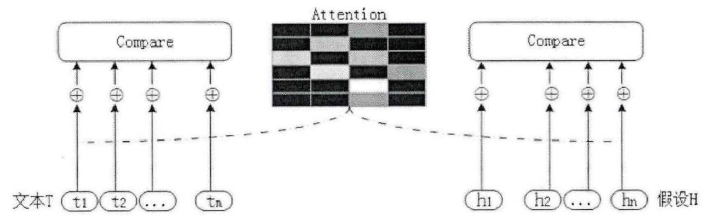
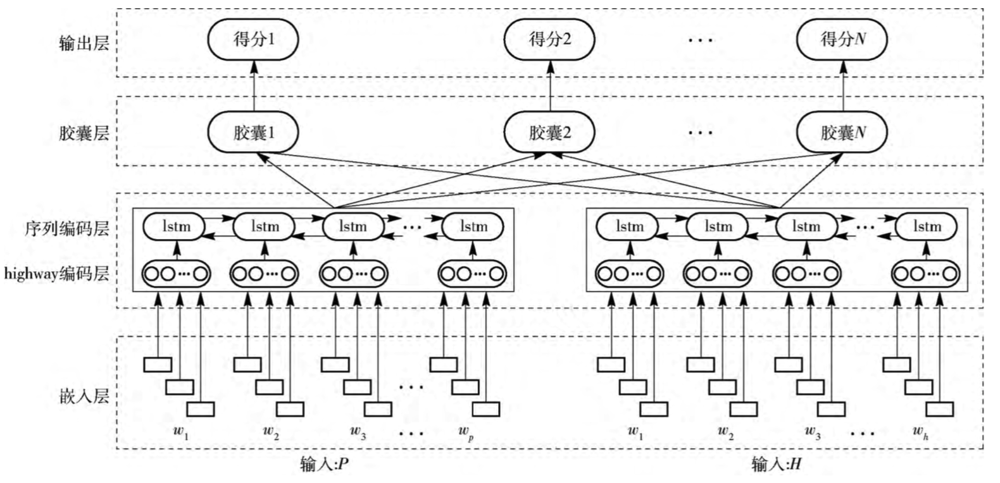

# Entailment with TensorFlow
### 简介

文本的entailment（蕴涵）是一个简单的逻辑练习，用来判断一个句子是否可以从另一个句子推断出来。承担了文本的entailment任务的计算机程序，试图将一个有序的句子分类为三个类别中的一种。第一类叫做“positive entailment”，当你用第一个句子来证明第二个句子是正确的时候就会出现。第二个类别，“negative entailment”是positive entailment的反面。当第一个句子被用来否定第二个句子时，就会出现这种情况。最后，如果这两个句子没有关联，那么它们就被认为是“neutral entailment”。
### 示例

当你读到“Maurita and Jade both were at the scene of the car crash”时，你可以推断“Multiple people saw the accident”。在这个例句中，我们可以用第一个句子(也称为“文本”)证明第二句(也称为“假设”)，这代表是positive entailment。鉴于莫丽塔和杰德都看到车祸，说明有多人看到。注意:“车祸”和“事故”有相似的意思，但它们不是同一个词。事实上，entailment并不总是意味着句子里有相同的单词，就像在这句话中可以看到的相同的词只有“the”。
让我们考虑另一个句子对。“在公园里和老人一起玩的两只狗”推导出“那天公园里只有一只狗”。第一句话说有“两只狗”，那么公园至少要有两只狗，第二句话与这个观点相矛盾，所以是negative entailment。
最后，为了阐明neutral entailment，我们看“我和孩子们打棒球”和“孩子们爱吃冰淇淋”这两句话，打棒球和爱吃冰淇淋完全没有任何关系。我可以和冰淇淋爱好者打棒球，我也可以和不喜欢冰淇淋的人打棒球(两者都是可能的)。因此，第一句话没有说明第二句话的真实或虚假。

### 应用

问答系统可以使用文本的entailment来验证存储信息的答案。文本的entailment也可以通过过滤不包含新信息的句子来增强文档的摘要。其他自然语言处理系统(NLP)也发现类似的应用。

---


本篇将分为三个部分：

- [源代码环境配置](#env)

- [基于LSTM方法的文本蕴含](#env1)

- [改进策略](#env2)

---


## <span id="env">源代码环境配置</span>

[原作者的README](https://github.com/Steven-Hewitt/Entailment-with-Tensorflow/blob/master/README.md)中已经提供了两种环境配置的选择，这里主要补充讲述anaconda安装tensorflow的详细步骤(两种方法)：

### - option A:

#### 1. 创建 TensorFlow 依赖环境
```
conda create -n tensorflow python=3.5
```
#### 2. 下载安装依赖软件，使用的是清华大学镜像仓库，选择合适的whl文件地址进行安装
```
pip install -i https://pypi.tuna.tsinghua.edu.cn/simple/ https://mirrors.tuna.tsinghua.edu.cn/tensorflow/windows/cpu/tensorflow-1.1.0-cp35-cp35m-win_amd64.whl
```
#### 3. 安装成功后按照原作者README激活环境并安装其他依赖即可

### - option B:

#### 1. 安装TensorFlow
```
pip3 install tensorflow
```

#### 2. 在代码开始处添加TensorFlow安装路径，例如：

```
import sys
sys.path.append('/usr/local/lib/python3.7/site-packages')
```


## <span id="env1">基于LSTM方法的文本蕴含</span>

### 1. 数字矢量化表示单词

  对于神经网络来说，需要处理数值。将单词意义转化为神经网络可以理解的数字的过程，称为矢量化（word vectorization）。
  创建 word vectorization的常用方法是让每个单词表示一个非常高维空间中的一个点。目前已经存在一些非常出色的通用矢量表示，本项目中使用的便是**斯坦福的GloVe word vectorization+ SNLI数据集**。GloVe也是目前测试准确率较高的词向量表示法。
  notebook code cell(标注以一次运行通过为准)：

  **In[2-4]**:收集textual entailment数据集,并解压

  **In[5]**:将空格分隔的格式序列化为Python字典

  **In[6]**:句子序列化

  **In[7]**:将句子向量可视化，转变为图像。一般来说，在相同的位置上包含相似颜色的两个向量表示单词在意义上相似。

### 2. 基于双向LSTM的句子编码技术

本项目是基于**RNNs**的，Recurrent neural networks(RNNs)是神经网络的一种序列学习工具。TensorFlow包含了它自己的一个简单RNN cell,BasicRNNCell的实现。在**In[8]** 构建了一个RNN网络。

**In[9-10]** 定义了一些网络常量。

  但是，RNNs存在**梯度消失**的问题，早期的数据完全被更新的输入和信息完全淹没，或者是带有标准隐藏单位的神经网络，在很长一段时间内都不能保持信息。

  解决方法便是使用不同的循环网络层，即长短期记忆层，也就是LSTM。在LSTM中,代替计算当前储存器时每次都使用相同方式的输入(xt)，网络可以通过“输入门”(it)决定当前值对储存器的影响程度做出一个决定,通过被命名为“忘记门”（ft）遗忘的存储器（ct）做出另外一个决定，根据储存器将某些部分通过“输出门”（ot）发送到下一个时间步长（ht）做第三个决定。这**三个门**的组合创造了一个选择:一个单一的LSTM节点，可以将信息保存在长期储存器中，也可以将信息保存在短期储存器中，但同时不能同时进行。**In[11]** 设置不包括之前的RNN网络，而是使用之后**In[12]** 定义的LSTM。

### 3. 用于复发层的Tensorflow的DropoutWrapper

如果我们只是简单地使用了LSTM层，那么这个网络可能会读到很多普通但无关紧要的词，比如“a”、“the”、和“and”。如果一个句子使用“an animal”这个短语，而另一个句子使用“the animal”，即使这些短语指的是同一个对象，网络也可能错误地认为它已经找到了negative entailment。

为了解决这个问题，我们需要看看个别单词最终是否对整体有重要意义，我们通过一个叫“dropout”的正则化过程来实现。为了防止**过度拟合**，dropout在训练过程中随机抽取网络中包含的部分，并在训练时将其临时调零，这样它们的输出就会被适当地缩放。

然而，dropout在LSTM层的内部门上做得并不是特别好，因此我们将跳过在内部门上的dropout。值得庆幸的是，这是Tensorflow的DropoutWrapper对于循环层的默认实现。

**In[14]** 中实现:

```python
lstm_drop =  tf.contrib.rnn.DropoutWrapper(lstm, input_p, output_p)
```

### 4. 完成模型

有了所有的解释，在**In[14]** 中完成模型。第一步是标记化，用我们的GloVe字典把两个输入的句子变成一个向量序列。由于我们不能有效地使用在LSTM中传递的信息，我们将使用从单词和最终输出的功能上的dropout，而不是在展开的LSTM网络部分的第一层和最后一层有效地使用dropout。

为了测试精度并开始增加优化约束，需要**展示TensorFlow如何计算准确预测标签的精度或百分比**。

**In[15]** 中确定一个损失，以显示网络的运行状况。由于我们有分类分数和最优分数，所以这里的选择是使用来自TensorFlow的softmax损失的变化:tf.nn.softmax_cross_entropy_with_logits。我们增加了正则化的损失以帮助过度拟合，然后准备一个优化器来学习如何减少损失。

由于之前我们安装了TQD，所以在**In[16]** 中我们可以跟踪网络训练的进度。

**In[17]** 是一个模型的测试，自己插入测试句子，最后输出为“Positive entailment”。

**In[18]** 结束会话释放系统资源。

## <span id="env2">改进策略</span>

### 1. 文本蕴含识别算法发展

   - 基于相似度的方法

通过计算前提和假设之间的相似度来判断其之间是否构成蕴含关系。简单易实现，但这种方法强行假设“相似及蕴含”是有明显缺陷的，这会导致有大量的文本蕴含关系识别错误。
         &emsp;&emsp;Jijkoun ["Recognizing Textual Entailment Using Lexical Similarity"](http://u.cs.biu.ac.il/~nlp/RTE1/Proceedings/jijkoun_and_de_rijke.pdf)——基于词袋模型的文本蕴含识别方法论文
   - 基于文本对齐的方法

不直接使用相似度判别蕴含关系，先把前提和假设相似的部分进行对齐，通过对齐的方式和程度作为最后判别是否为蕴含关系的依据。优点是能够更好体现两个文本之间的相似度。缺点在于需要引入先验知识进行对齐，并且存在一些一对多、多对多的对齐情况难以操作。
         &emsp;&emsp;Marneffe论文["Finding Contradictions in Text"](http://www.aclweb.org/anthology/P08-1118)
   - 基于逻辑演算

一般是将文本表示成数学逻辑表达式，比如一阶逻辑，构成事实集合，然后用逻辑推理规则判断是否能根据前提推理出假设。把数学界机器证明领域成熟的思想迁移到文本蕴含识别领域，具有一定的理论基础，但文本到逻辑表达式的转换不够鲁棒，容错性较差。而背景知识缺失往往导致推理链条的中断，导致结果召回率偏低。
         &emsp;&emsp;Raina论文["Robust textual inference via learning and abductive reasoning"](https://nlp.stanford.edu/manning/papers/aaai05-learnabduction.pdf)
   - 基于文本转换

语义角色标注，把前提和假设都表示成某种语言表示形式，如句法树、依存图等。然后利用背景知识设计推理规则将前提和假设进行改写。保留了基于逻辑演算的内核，同时不再要求把前提和假设表示成逻辑表达式，避免了引入噪音，但是该方法严重依赖转换规则。这些转换规则有的来自于知识库有的来自于语料。
         &emsp;&emsp;Bar-Haim论文["Semantic Inference at the Lexical-Syntactic Level"](http://www.aaai.org/Papers/AAAI/2007/AAAI07-138.pdf)
   - 基于混合模型

把诸如前提和假设的词级别相似度（如单词重叠率、同义词、反义词等）、句法树相似度、句法树编辑距离、对齐程度、由Ｔ转换为Ｈ的代价等等混合在一起作为特征，送入分类器（如支持向量机等）进行分类。
   - 基于深度学习的模型

通过搭建神经网络进行建模，优点在于由机器自动进行特征提取、筛选、组合，避免了人工提取特征的局限性。缺点在于所需数据量较大，网络结构的设计直接影响到提取特征的好坏。
         &emsp;&emsp;Yin论文["ABCNN: Attention-Based Convolutional Neural Network for Modeling Sentence Pairs"](https://arxiv.org/pdf/1512.05193.pdf)——基于Attention机制的卷积神经网络来处理RTE问题
         &emsp;&emsp;Rocktäschel论文["Reasoning about Entailment with Neural Attention"](https://arxiv.org/pdf/1509.06664.pdf)——使用LSTM进行RTE在SNLI数据集上的准确率为0.832。

### 2. Entailment with TensorFlow改进

   - 引入注意力机制

传统的硬对齐方法将文本T与假设H进行语法结构分析或依存分析，按照语法成分对文本T与假设H进行对齐，例如主语与主语对齐、谓语与谓语对齐。但由于英文文本中语法结构的多样性和复杂性，硬对齐方法存在一些问题，例如语法结构分析有误、语法成分过于复杂很难对齐。
     基于注意力机制的软对齐方法认为文本T与假设H中的每个单词都有相关性，但相关性权重有差别，构建文本表示之间的注意力关系矩阵，而不需要考虑文本长度。相比于硬对齐，软对齐的可扩展性更好。
  
     &emsp;&emsp;在tensorflow1.0版本以后的api seq2seq库中，包含了两种Attention算法，他们的区别就是match操作的不同，也称为加法Attention和乘法Attention。

```
attention_mechanism = tf.contrib.seq2seq.BahdanauAttention(rnn_hidden_size, encoder_output)
decoder_cell = tf.contrib.seq2seq.AttentionWrapper(d_cell, attention_mechanism, attention_layer_size=rnn_hidden_size)
de_state = decoder_cell.zero_state(batch_size,dtype=tf.float32)
out_cell = tf.contrib.rnn.OutputProjectionWrapper(decoder_cell, target_vocab_size)
```

```
attention_mechanism = LuongAttention(num_units =num_units,memory=context)
att_wrapper = AttentionWrapper(cell=mutil_layer,attention_mechanism=attention_mechanism,attention_layer_size=att_size,cell_input_fn=lambda input, attention: input)
states = att_wrapper.zeros_state(batch_size, tf.float32)
```

基于胶囊的英文文本蕴含识别方法论文中还提出了一种基于胶囊的英文文本蕴含识别算法：针对不同类别的蕴含关系分别构建胶囊，使每个胶囊能刻画其对应蕴含关系的特征信息。
    

   - 采用词形还原（Lemmatization）

Textual Entailment with TensorFlow项目中采用的是词干提取，词干提取的目标是将一个词汇的词根抽取出来，不同的词汇可能具有相同的词根，词根本身已不再是一个单词，因而提取后的结果可能不再有完整的语义。而词形还原只需处理掉不同单词的词缀信息从而得到单词本身的归一化表示

```
from nltk.stem import WordNetLemmatizer
wnl = WordNetLemmatizer()
```

   - 数字规格化
     

对于同一个数字，英文存在多种表示方法，这就造成了后续蕴含关系的识别困难，可以将不同形式的数字统一为阿拉伯数字形式。

   - 去除停用词
     

例如"the"、"is"、"at"等在英文文本蕴含识别中对于识别蕴含关系没有太多帮助且出现频繁，可以去除这些停用词。

------

参考：

1. [基于混合神经网络的英文文本蕴含识别研究与实现_朱皓](http://cdmd.cnki.com.cn/Article/CDMD-10013-1018116971.htm)
2. [A Decomposable Attention Model for Natural Language Inference](https://arxiv.org/pdf/1606.01933.pdf)
3. [深度学习：如何理解tensorflow文本蕴含的原理](https://cloud.tencent.com/developer/article/1049549)


