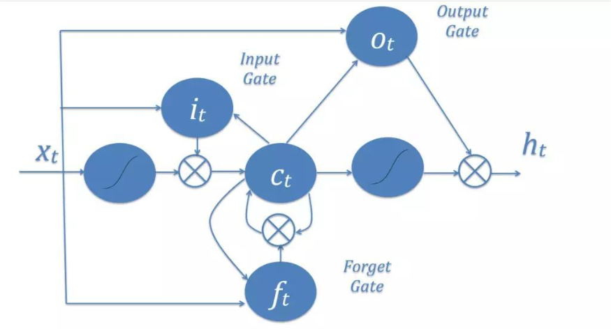

# Entailment-with-Tensorflow

在自然语言处理(natural language processing)中，文本蕴涵(Textual entailment)是指两个文本片段有指向关系。当认为一个文本片段真实时，可以推断出另一个文本片断的真实性。文本蕴含并不是常规的逻辑推理，相较于缜密的逻辑推理而言，文本蕴含的条件更加宽泛，可以以这样的方式来描述文本蕴含，如果一个文本片段真实时，可以推断另一个文本片段的真实性。  

## 1 项目依赖  

1.使用**Anaconda**创建Python虚拟环境用于运行源代码，python版本：3.5  
2.使用`pip`工具安装 [TensorFlow v1.0](https://www.tensorflow.org/),[Jupyter](http://jupyter.org/),[NumPy](http://www.numpy.org/) ,[TQDM](https://pypi.python.org/pypi/tqdm)以及[Matplotlib](http://matplotlib.org/)  
3.下载单词映射数据集[glove.6B.zip](http://nlp.stanford.edu/data/glove.6B.zip)以及模型训练数据集[snli_1.0.zip](https://nlp.stanford.edu/projects/snli/snli_1.0.zip),并将这两个用于训练的数据集放入工程文件目录下

## 2 运行项目

### 2.1 方法A

1.打开Anaconda命令行终端，键入命令`conda activate python_name`  
2.使用`cd`命令进入项目所在文件夹下  
3.执行命令`python train.py`运行本项目。  
4.程序会自动读取工程目录下的训练数据与映射数据文件，并在对模型完成训练，将训练好的模型存放在'Trained Model'目录下

### 2.2 方法B  

1.打开Anaconda命令行终端，键入命令`conda activate python_name`  
2.使用`cd`命令进入项目所在文件夹下  
3.执行命令`jupyter notebook`，以jupyter笔记本的方式可以单步执行本项目。  
4.模型训练完成之后，会保存在'Trained Model'文件目录下  

## 3 问题描述与项目流程    

### 3.1 问题描述

该项目的主题是自然语言处理中的文本蕴含。如果能通过作为前提的语段推理得出作为假设的语段，则可称该前提蕴含该假设。文本蕴含识别（Recognizing Textual Entailment，RTE）主要目标是对前提和假设进行判断，判断两者间是否具有蕴含关系。文本蕴含识别形式上是一个文本分类的问题，在该项目中是一个三分类的问题，其label分别为entailment，contradiction，neutral。

### 3.2 项目流程

1.该项目首先通过分词，将输入的语句划分成单个的词语并存放在列表当中，在本项目中通过字符串的spilt函数以空格对语句字符串进行切割的方式达到了分词的目的。  

2.程序通过读取**glove.6B.zip**中的数据内容，将其读入一个Python字典`glove_wordmap`中。并对分词后的句子中每一个通过`glove_wordmap`字典进行映射，把每一个单词映射为维数为50的向量。对输入语句分词之后所得到的单词列表全部进行映射，假设该输入语句共由n个单词组成，即分词后得到一个包含n个元素的列表，那么将整个分词后的列表按语序进行映射，得到一个`n行50列`的矩阵作为训练的输入，在程序中，通过**sentence2sequence**函数来实现了对单个输入语句映射为50维矩阵的功能；同时，并使用**split_data_into_scores**函数将用于文本转换为单纯的使用数字表示的数据。  

    单词的数字化表示

    为了便于神经网络处理，实验中使用的单词需要进行数字化的表示来表示我们的单词。最理想情况是,单词所转化成的数字能有着某种意义。相反的例子是,如果我们使用每个字母的字符编码来拼接出一个词的数字化表示，则并不能表示出任何关于单词本身的意义(这意味着TensorFlow需要做大量的工作来说明“dog”和“canine”是几乎相同的概念)。我们需要将单词的意义转化为神经网络可以理解的形式，该项目给出的解决方案矢量化。
3.读取给定的训练数据集，对训练数据集进行分词处理后通过上一步中的映射处理，得到一个50维的矩阵用于输入。    

4.利用**LSTM**长短期神经网络搭建一个简单的模型。

    LSTM较传统RNN的优势 

    循环神经网络模型（RNN）是一种节点定向连接成环的人工神经网络，是一种反馈神经网络，RNN利用内部的记忆来处理任意时序的输入序列，并且在其处理单元之间既有内部的反馈连接又有前馈连接，这使得RNN可以更加容易处理不分段的文本等。但是由于RNN只能对部分序列进行记忆，所以在长序列上表现远不如短序列，造成了一旦序列过长便使得准确率下降的结果。
    长短期记忆模型（LSTM）是RNN模型的一种特殊结构类型，其增加了输入门、输出门、忘记门三个控制单元（“cell”），随着信息的进入该模型，LSTM中的cell会对该信息进行判断，符合规则的信息会被留下，不符合的信息会被遗忘，以此原理，可以解决神经网络中长序列依赖问题。 

    
5.并在同时使用`DropoutWrapper`方法实现drop out正则化，避免了由于语句中重复出现的"the","and"等单词导致神经网络判断错误的情形。  

    神经网络正则化

    为了防止过拟合问题，我们需要对神经网络模型进行正则化。
    dropout是神经网络设计中的一种正则化模式，它围绕着随机选择的隐藏和可见的单位。随着神经网络的大小增加，用来计算最终结果的参数个数也随着增加，如果一次训练全部，每个参数都有助于过度拟合。为了规范这一点，在训练中随机抽取网络中包含的部分，并在训练时临时调零，在实际使用过程中，它们的输出被适当地缩放。
    我们将dropout应用与LSTM神经网络，最大的作用就是可以减少权重使得网络对丢失特定神经元连接的鲁棒性提高。

6.设定完成LSTM相关参数之后，将数字化后的训练数据输入模型当中，对模型进行持续训练，在训练完成之后将模型保存在本地，通过程序提供的准确度判断可以发现，通过该数据集训练出的模型预测准确率约在百分之五十左右。  

## 4 项目改进

### 4.1 数据集改进

增加数据集大小。对深度学习而言，提高预测准确率非常关键的一个因素就是样本集的大小，因而提高样本集的规模是提高深度学习模型性能的关键，通过获取更多的数据来训练深度学习模型，以达到更好的预测性能。

### 4.2 模型调优

深度学习模型有很多超参数，超参数在一定程度上决定了模型的性能优劣。我们当前正尝试调整模型的参数，来使模型拥有更好的分类表现。比如，我们可以调整模型的隐含层的数量、模型的学习率等。

### 4.3 单词的数字化表示改进

项目所提供了常见英文单词到50维向量的映射的数据集。我们并不能确定该映射方式的优劣。若我们了解项目所提供的单词到50维向量的映射的数据集是如何生成的，则可以考虑能否获得更优的映射数据集以得到更好的训练结果。项目提供的是常见单词到50维向量的映射，如果知道其映射算法，则可以考虑更改算法以更改单词对应生成的向量维度，获得可用于对照实验的新的数据集，从而可能通过实验得到更优的转化维度。或者，寻找更能体现单词特征的映射转化方式（不仅仅是改变维数），来获得更优的结果。

