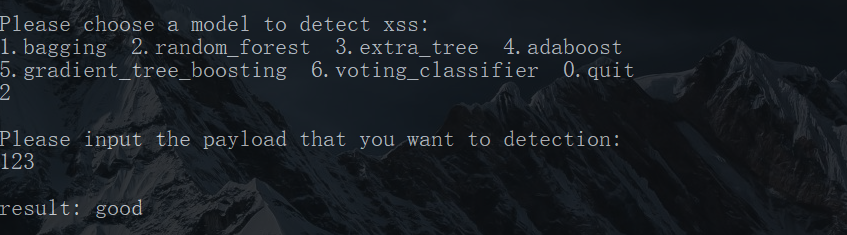
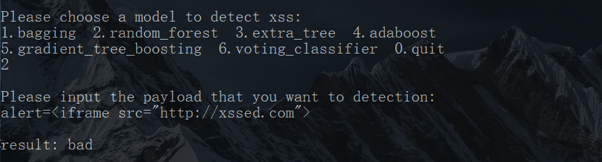

# XSS DETECTION

​	本项目分别对已有的XSS注入攻击数据集进行特征选取处理后，分别使用了SVM、Random Forest、extra_tree等多种算法对已有数据集进行训练，获得了相应模型参数，且能够通过相应接口接收需要检测样本并给出判断结果。

## 1 项目依赖

- Python:3.5
- TensorFlow:2.0

## 2 XSS DETECTION

​	本项目采用了两种数据特征选取方法，分别以自定义选取的十种特征与使用嵌入式词向量模型生成XSS词向量特征的方法 ，将同一个原始数据集处理为两个不同的训练数据集，并使用SVM、Random Forest等机器学习模型进行训练并判断用户输入的URL。

### 2.1 嵌入式词向量特征选定

#### 2.1.1 数据预处理与模型训练

​	首先，通过使用嵌入式词向量模型建立了一个XSS语义模型； 选取负样本与正样本中出现频率最高的3000个词，构成词汇表，使得机器能够里如"alter"、"\<script\>"等HTML、JS语言，最终能够将原始样本转换输出为一个维数为32的词向量，输入模型进行训练。本项目通过使用word2vec模块实现了以上功能
​	在完成了对样本的预处理之后，将已有的32位特征向量输入SVM模型之后进行训练，训练完成之后保存相应参数，且给出了输入接口，用于接收用户键入的URL并给出判断结果。

#### 2.1.2 训练结果

- **召回率：99.66%**
- **精确率：98.22%**
- **具体结果截图[SVM](Screen\SVM.png)**

### 2.1.3 运行

#### 2.1.3.1 运行方法

1. 运行``word2vec.py``文件，将整理得到的数据集通过范化、分词等操作转换为词向量，存储到``word2vec.pickle``文件中。

2. 运行svm.py文件，划分数据集，预处理从``xssed.csv``和``normal_payload.csv``导入的数据，之后训练SVM，将得到的模型保存到SVM_model文件中。

3. 运行``predict.py``文件，导入模型，输入想要测试的数据，返回值为1，则为xss payload；返回值为0，则为正常请求数据。

#### 2.1.3.2 运行结果

- 输入正常URL判断结果为非恶意URL

- 输入含有**XSS**攻击的URL，判断结果为恶意URL

## 2.2 自定义的特征选取

​	通过研究XSS攻击中出现频率最频繁的十个特征，将原始数据集向量化，并将处理好的数据输入随机森林等多种模型算法进行训练，获得模型参数，保存之后接收用户键入的URL，给出判断结果。

### 2.2.1 特征选取

​	本项目选取的十个特征分别为：

- 是否含有"**javascript**"
- 是否含有"**java**"
- 是否含有"**iframe**"
- 是否含有"**<**"
- 是否含有"**>**"
- 是否含有"**\\**"
- 是否含有"**\\ '**"
- 是否含有"**%**"
- 是否含有"**(**"
- 是否含有"**)**"

### 2.2.2 训练结果

#### 1. Random_Forest

- **正例召回率：100%	负例召回率：97%**
- **正例精确率：97%	负例精：率：100%**
- **正例 F1值：98%  负例F1值：98%**
- **具体结果截图[Random_Forest](Screen\RandomForest.png)**

#### 2.  Bagging

- **正例召回率：100%	负例召回率：97%**
- **正例精确率：97%	负例精确率：100%**
- **正例 F1值：98%  负例F1值：98%**
- **具体结果截图[Bagging](Screen\Bagging.png)**

#### 3.  Extra_tree

- **正例召回率：100%	负例召回率：97%**
- **正例精确率：97%	负例精确率：100%**
- **正例 F1值：98%  负例F1值：98%**
- **具体结果截图[Extra_tree](Screen\Extra_tree.png)**

#### 4.  Adaboost

- **正例召回率：100%	负例召回率：97%**
- **正例精确率：97%	负例精确率：100%**
- **正例 F1值：98%  负例F1值：98%**
- **具体结果截图[Adaboost](Screen\Adaboost.png)**

#### 5.  Gradient_tree_boosting

- **正例召回率：100%	负例召回率：97%**
- **正例精确率：97%	负例精确率：100%**
- **正例 F1值：98%  负例F1值：98%**
- **具体结果截图[Gradient_tree_boosting](Screen\Gradient_tree_boosting.png)**

#### 6.  Voting_classifier

- **正例召回率：100%	负例召回率：97%**
- **正例精确率：97%	负例精确率：100%**
- **正例 F1值：98%  负例F1值：98%**
- **具体结果截图[Voting_classifier](Screen\Voting_classifier.png)**

### 2.2.3 运行

#### 2.2.3.1 运行方法

- 运行``train_model.py``文件，根据提示选择相应的模型算法对数据进行训练，并将模型保存在本地。
- 运行``xss_predict.py ``文件，选择已经训练好的模型进行预测。
- 输入需要检测的URL，程序自动给出预测结果。

#### 2.2.3.2 运行结果

- 选择相应的输入正常URL判断结果为非恶意URL

- 输入含有**XSS**攻击的URL，判断结果为恶意URL

## 3 反思

​	从预测的结果来看，尽管模型的预测精确率和模型的召回率都很高，但是由于我们选取的数据特征有限，导致模型泛化的能力很差，当攻击者将含有XSS攻击URL通过某些形式进行转码或者其它方式隐藏之后，使得模型无法正确地预测出结果，且我们现有样本也极其有限，没有广泛包含各种类型的XSS攻击，也是使得模型泛化能力较差的原因之一。