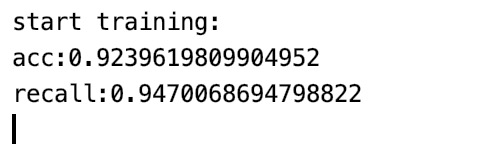
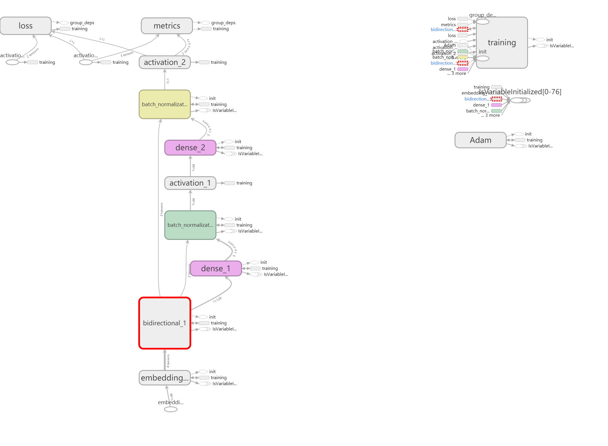
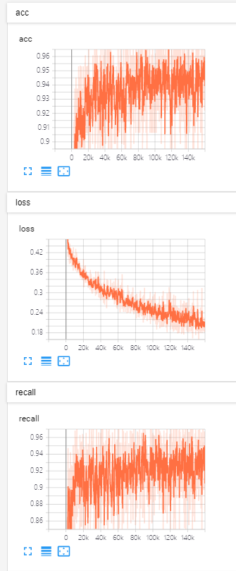

# DGA 域名检测

> 这次我们小组分别用了 SVC 和 LSTM 对正常域名和 DGA 域名进行了检测，其中 SVC 的准确率是 92.4%，召回率为 94.7%左右，而 LSTM 的准确率为 94.8%，召回率为 92.3%。

​ ~~**_但是 LSTM 更加耗电，所以：没错，SVC 天下第一，LSTM 天下第二_**~~

## Part 1. SVC

### 1.1 数据来源

- Cisco 统计的，全世界访问量前一百万的域名(为了和恶意域名数量匹配，只取前 10000 项)，top1m.csv
- 360 统计的不同种类的 DGA 域名近一万条

### 1.2 特征提取

1. 域名长度
2. 域名的信息熵
3. 域名的元音个数
4. 域名中连续的两个辅音的个数
5. 域名中数字的个数

### 1.3 模型训练

- 训练集：测试集 = 0.9 : 0.1

- ~~没错 SVC 就是这么简单~~

- ```python
    print("start training:")
    svm = SVC(kernel="rbf", random_state=1, C=0.9,gamma="auto", max_iter=100000)
    svm.fit(X_train_std, y_train)

    joblib.dump(svm, "svm_model")

    y_pred = svm.predict(X_test_std)
    print("acc:{}".format(accuracy_score(y_test, y_pred)))
    print("recall:{}".format(recall_score(y_test, y_pred)))
  ```

### 1.4 准确率和召回率截图



## Part 2. LSTM

### 2.1 网络结构



### 2.2 准确率和召回率

最后准确率 94.80%，召回率 92.24%


