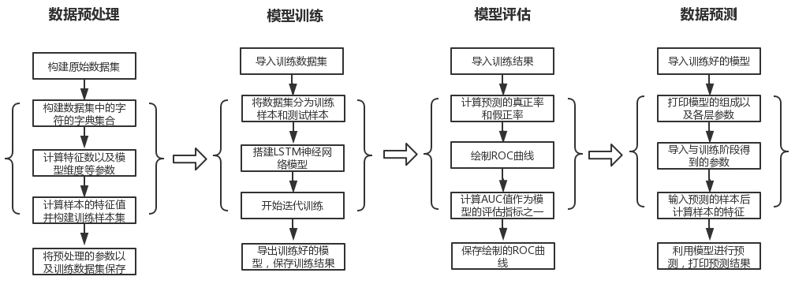
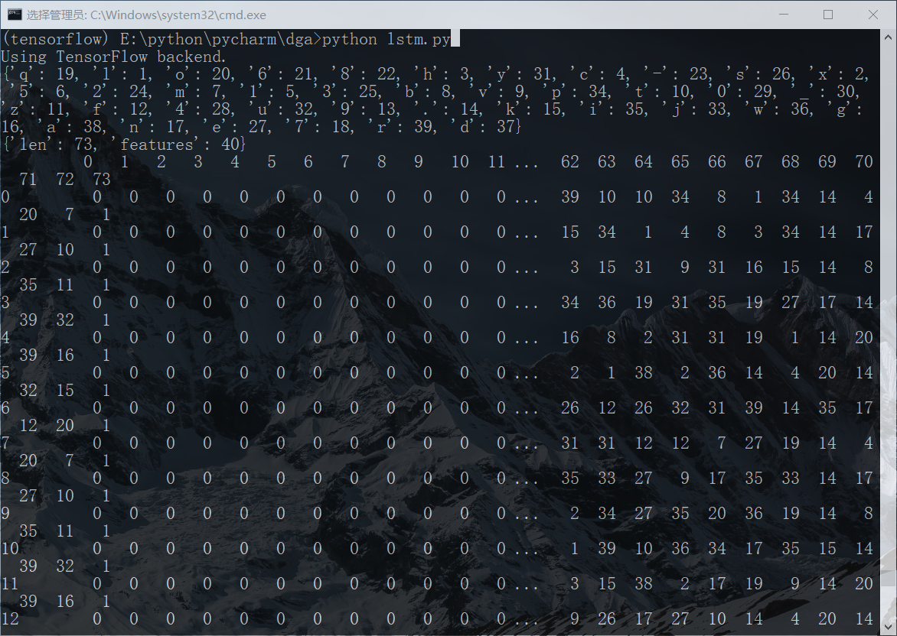
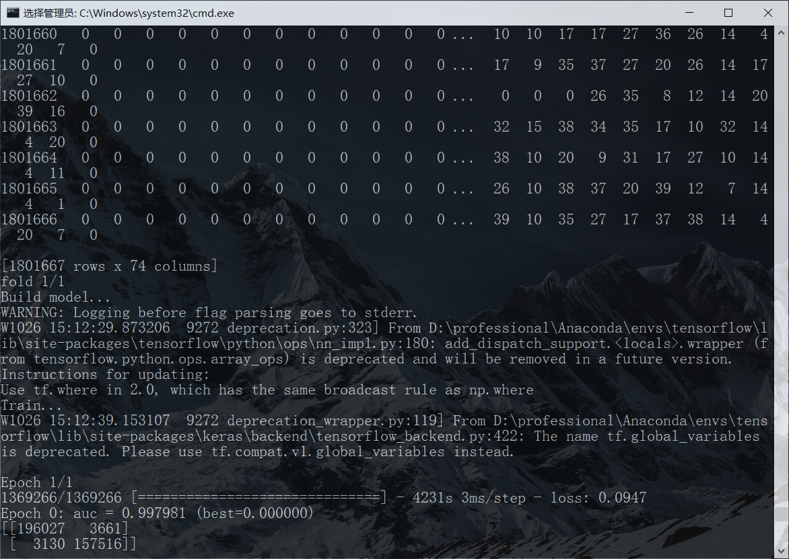
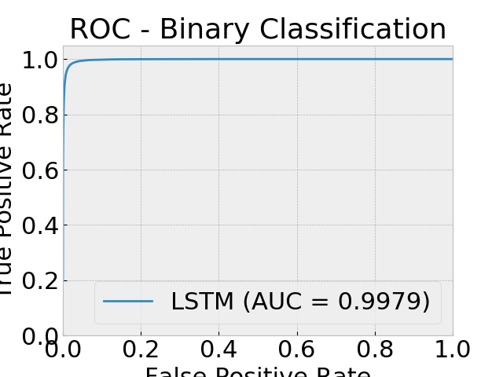
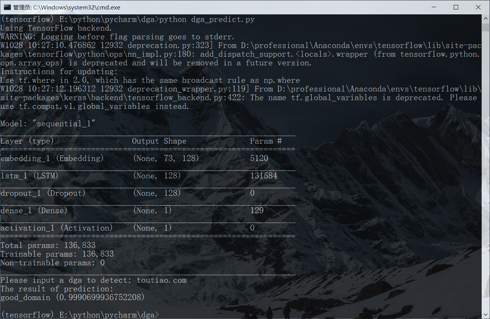
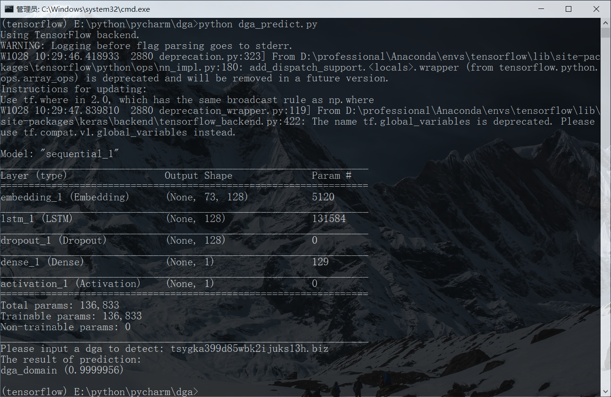

# DGA Domain Detection with LSTM

## 摘要

随着社交网络的高速发展，社交平台已成为舆情事件发生、发展与演化的重要阵地。因此，面向社交平台分析网络舆情发展趋势，挖掘舆情背后的深层规律，一方面能帮助管理者分析用户偏好、掌握用户需求，提高服务的个性化程度与用户体验；另一方面，能够客观反映社会舆论导向，系统全面的体现网民的社会价值观,帮助决策者提升应对突发事件的处置能力。针对现有网络舆情分析系统存在的舆情数据采集困难及分析方法单一等问题。本项目设计了一种高效的数据爬虫，并结合情感分析及观点挖掘的方法，研发了一套面向微博平台的网络舆情分析系统。通过构建该系统能够实现微博平台舆情动态快速的呈现，能够有效提高检测和掌控目标舆情发展趋势的时效性和便捷性。

### 数据示例

- 正常域名
  - *eastday.com*
  - *clkmon.com*
  - *softonic.com*
  - *google.com.vn*
  - *mailchimp.com*
- DGA域名
  - *raojridehtkgm.ru*
  - *htaolhtl.cc*
  - *reputationargueletessayavoid.com*
  - *tsygka399d85wbk2ijuks13h.biz*
  - *ourindianstagetheirof.com*

### 项目特点

- 本项目可应用于对**DGA域名的识别**，在用户输入域名后，可以给出检测的结果；
- 本项目基于多个数据集最终组成了有**1801667**条数据的**数据集**，其中正常域名数据**1000000**条，DGA域名**801667**条；
- 本项目基于深度学习的**LSTM**模型来构建分类器，并主要使用了机器学习库Keras来搭建模型；
- 经过模型训练和测试，构建的分类器的**AUC**值在**0.998**左右，**LOSS**函数的值在**0.094**左右；
---


下面以四个部分介绍本项目：

- [系统实现框图](#env0)

- [项目环境依赖](#env1)

- [项目结构与运行方法](#env2)

- [系统运行截图](#env3)

---

## <span id="env0">一、项目实现框图</span>

<div align="center">

</div>

## <span id="env1">二、项目环境依赖</span>

### 1. Anaconda集成环境
- Anaconda 4.7.10
- Python 3.5
### 2. 第三方库
- pandas 0.23.0 
- numpy 1.17.2
- keras 2.3.1
- scikit-learn 0.19.1
- scipy 1.2.1
- matplotlib 3.1.0

## <span id="env2">三、项目结构与运行方法</span>

### 1. 项目结构

      ├── README.md                         
      ├── Code                             // 存放程序代码文件
      │   ├── data_preprocess.py             
      │   ├── lstm_train.py           
      │   ├── result_show.py      
      │   └── dga_predict.py                
      ├── Data                             // 存放原始数据集和训练数据集
      │   ├── chars.json                               
      │   ├── max.json        
      │   ├── data.csv                 
      │   └── traindata.pkl   
      ├── Model                            // 存放训练好的模型和训练结果
      │   ├── model.h5                            
      │   ├── model_weights.h5                     
      │   └── results.pkl                
      └── Screen                           // 存放系统框图和运行截图
          ├── flowchart.png                 
          ├── train1.png    
          ├── train2.png
          ├── result.png    
          ├── predict1.png                          
          └── precict2.pkl    

### 2. 运行方法

#### (1) 激活Anaconda环境
进入项目文件夹，并激活Anaconda环境。
```
activate tensorflow
```
#### (2) 数据预处理
根据*traindata.pkl*中的原始数据集进行预处理并构建名为*data.csv*的训练数据集。
```
python data_preprocess.py
```
#### (3) 模型训练
利用构建好的训练数据集训练LSTM模型，并将训练好的模型保存。
```
python lstm_train.py
```
#### (4) 模型评估
绘制ROC曲线，并计算AUC值来评估模型的预测性能。
```
python result_show.py
```
#### (5) 数据预测
用户输入要进行检测的域名，系统能返回检测的结果。
```
python dga_predict.py
```

## <span id="env3">四、系统运行截图</span>

### 1. 模型训练截图
</br>
<div align="center">

</div>
</br>

<div align="center">

</div>
</br>

### 2. 模型评估截图
</br>
<div align="center">

</div>
</br>

### 3. 数据预测截图
</br>
<div align="center">

</div>
</br>

<div align="center">

</div>
</br>

------
