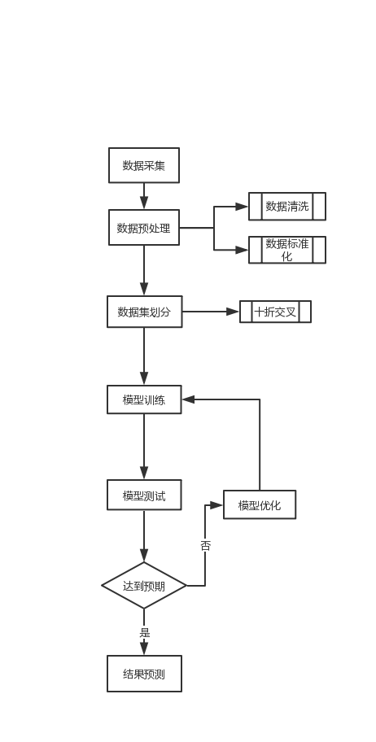

# 利用LSTM检测DGA
## 依赖环境
​	tensorflow
​	sklearn
​	tflearn
​	numpy
​	tldextract
​	pickle
​	pandas

## LSTM
&emsp;长短期记忆网络（LSTM，Long Short-Term Memory）是一种时间循环神经网络，是为了解决一般的RNN（循环神经网络）存在的长期依赖问题而专门设计出来的，所有的RNN都具有一种重复神经网络模块的链式形式。在标准RNN中，这个重复的结构模块只有一个非常简单的结构，例如一个tanh层。LSTM，可以学习长期依赖信息，该项目中使用LSTM来学习字符序列（域名）的模式，从而帮助我们识别哪些是DGA生成域哪些不是。
&emsp;使用LSTM可以不必提取特征（如长度、元音、辅音、n-gram等），因此可以省去特征提取这一步骤。

## 实现框图

## 文件描述
&emsp;&emsp;mydata.py用于获取数据集，并将其保存在traindata.pkl中;
&emsp;&emsp;mylstm.py用于建立模型并训练模型。

## 实验结果

## 项目进展
&emsp;&emsp;项目在模型训练方面经过多次改进，但是准确率仍然偏低，目前仍在进行下一步的优化。

##  参考资料

&emsp;&emsp;https://www.freebuf.com/articles/network/139697.html

