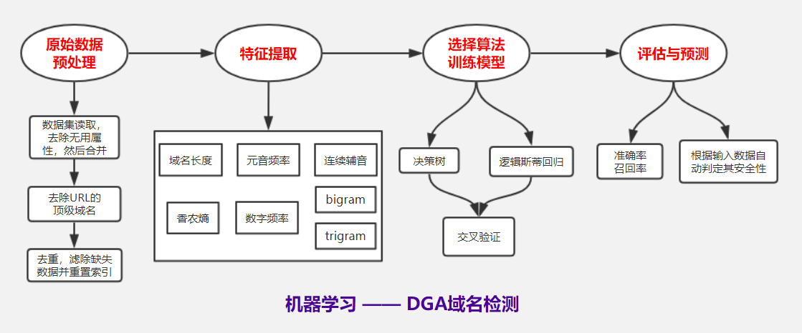

# DGA域名检测

## 什么是DGA

#### 域名生成算法(Domain Generation Algorithm，DGA)，是一种利用随机字符来生成C&C域名，从而逃避域名黑名单检测的技术手段。例如，一个由Cryptolocker创建的DGA生成域xeogrhxquuubt.com，如果我们的进程尝试其它建立连接，那么我们的机器就可能感染Cryptolocker勒索病毒。域名黑名单通常用于检测和阻断这些域的连接，但对于不断更新的DGA算法并不奏效。 

### 示例
- gwgweakshkaxnqv.org
- giwvnxpbqkvsnet.co.uk
- hxvwkpjigbybwyw.info
- bpmpfnagtcdmuuk.com
- cflqcftnjsguukr.net
- cq39cpldyvsscp4npk.biz
- sympathyre42gretcl2aim6transition.com
- trafficca77trew4ardshopfi9nance.com
- register4batsc25ale9dishw7itness.com
- impactpullcelebrateswitch.com
- linkfanaccountpostbecome.com

## 实现流程

### 原始数据预处理

1. 数据集读取，去除无用属性，然后合并。
1. 去除URL的顶级域名后缀。
1. 去重，滤除缺失数据并重置索引。

### 特征提取

1. 域名长度：DGA域名长度较长；

1. 元音频率：DGA域名中元音出现的频率小且重复率较低；

1. 连续辅音：DGA域名辅音离散度大；

1. 信息熵： DGA域名各字符出现概率接近且小；

   信息熵公式：
   $$
   H(x)=-\sum_{i=1}^{n}p(x_i)log(p(x_i))
   $$
   其中$p(x_i)$代表事件x_i的概率，在这里即表示某个字母的出现概率。信息熵作为一个系统复杂程度的度量，如果系统越复杂那么信息熵也会越大

1. 数字频率：DGA域名中使用数字的概率较高；

1. bigram： DGA域名中存在大量少见的2字符组合；

   bigram是二元分词，把句子从头到尾每两个字组成一个词语，计算式为：
   $$
   P(w_1,w_2...w_m)=\prod_{i=1}^{m}P(w_i|w_{i-1})
   $$
   利用极大似然法求出一组参数，死的训练样本的概率取得最大值：
   $$
   P(w_i|w_{i-1})=\frac{C(w_{i-1}w_i)}{C(w_{i-1})}
   $$
   

1. trigram： DGA域名中存在大量少见的3字符组合。

   trigram是三元分词，把句子从头到尾每三个字组成一个词语,计算式为：
   $$
   P(w_1,w_2...w_m)=\prod_{i=1}^{m}P(w_i|w_{i-2}w_{i-1})
   $$
   拓展：

   N-gram：假设有一个字符串s，那么该字符串的N-gram就表示按长度N切分原词得到的词段，也就是说s中所有长度为N的子字符串

   N-gram距离：
   $$
   |G_{N}(s)|+|G_{N}(t)|-2*|G_N(s)∩G_N(t)|
   $$
   其中$|G_N(s)|$是字符串s的N-gram集合，N一般取2或3

   由于数据稀疏的存在，极大似然法冰壁是一种很好的参数估计办法，所以引出了平滑技术，其主要策略是把在训练样本中出现过的事件的概率适当减小，然后把减小得到的概率密度分给训练语料中没有出现过的事件。

### 归一化处理

1. 对提取好的特征使用最大最小归一化算法进行归一化处理，以提升在Logistics回归模型中的收敛速度和模型精度。
2. 但是在使用决策树模型时，最好使用没有归一化处理过的数据，所以我们同时也准备了没有归一化处理过的数据。

### 选择算法并训练模型

1. 决策树
1. 逻辑斯蒂回归
1. K折交叉验证

### 预测与评估

1. 计算准确率与召回率
1. 根据输入数据自动判定其是否为DGA域名

## 结果分析
