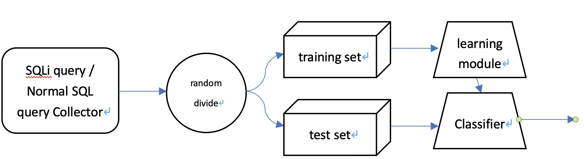

# SQL注入检测

> 根据老师给出的GitHub上开源的SQL注入检测项目的代码进行修改，最终选取了SVM、KNN、logistic、决策树、随机森林三种算法进行轻改比较，在这个问题上，看起来传统机器学习的优势还要更大一些，无论是速度，精确度还是召回率上。当然我猜也许和数据集并不是那么全面有一定的关系

## 数据来源

- [项目拥有者自己的数据集](https://github.com/flywangfang258/ML-for-SQL-Injection/tree/master/ML_for_SQL/data)

## 特征提取

1. 数字字符频率
2. 大写字母频率
3. 语句中出现的、一般不会用在正常SQL查询中的词(比如and,union等等)的频率
4. 语句中出现的、一般不会出现在正常SQL查询中的字符(比如'、(和他的url编码%27)"、=等等)的频率
5. 语句中出现的编码字符的频率(按照%、&、\x和\u计算)

## 模型训练

- 训练集：测试集 = 0.9 : 0.1
- 在调整特征的过程中发现这个原作者好像有点憨憨，有不少错误，改正之后大概各种算法的最终准确率和召回率都在90%左右
- 在添加了对一些字符的检测以及不同字符的权重之后，各个算法都能维持在98%的准确率和95%的召回率。

## 系统流程

