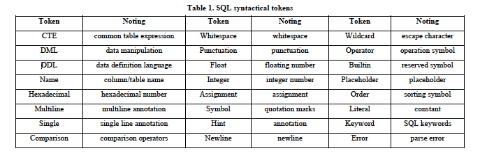
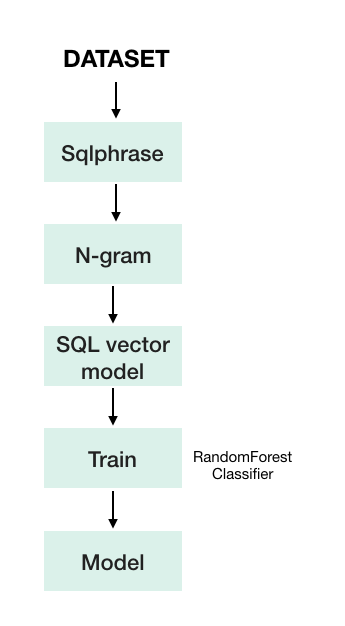
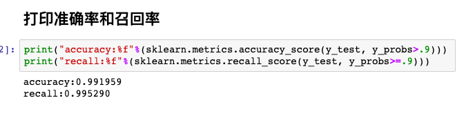

# SQL 注入语句检测

SQL注入是一种代码注入技术，用于攻击数据驱动的应用程序，在这种技术中，恶意SQL语句通过从客户端到应用程序的输入数据插入或“注入”SQL查询。成功的SQL注入攻击可以从数据库读取敏感数据,修改数据库数据(插入/更新/删除),在数据库上执行管理操作(如关闭DBMS),恢复一个给定文件的内容出现在DBMS文件系统和在某些情况下命令来操作系统问题。SQL注入攻击是注入攻击的一种，它将SQL命令注入到数据平面输入中，从而影响预定义SQL命令的执行。

## 特征选择--sqlphrase、ngram

SQL是一个结构化的语言,遵循标准的语法规则,它有一个完整的词汇和语法系统。SQL查询字符串的每个部分可以转换成语法标记语法分析。所以与之前单纯的收集特征不同，我们需要考虑SQLi的语义，所以我们使用了sqlphrase库。

经过sqlphrase，一个SQL查询的字符串“SELECT username,password FROM TABLE customers WHERE id=1”会转化为一个序列:“['DML','Name','Punctuation','Name','Keyword', 'Keyword', 'Name', 'Keyword', 'Name', 'Comparison','Integer']”。

下图是SQL语法标记

标记序列和标记之间的转换更有意义，所以我们还将通过计算每个SQL语句的ngram来计算序列，这里使用N=3

## 系统流程图

## 

## 训练模型

使用随机森林模型，预测时使用了‘predict_proba’，模型将根据各种指标计算类匹配的概率。例如，随机森林将概率函数建立在森林中有多少棵树投了这一票或那一票的基础上。所以0.7的概率意味着70%的树投给了一个方向另外30%投给了另一个方向。

## 结果

准确率：0.991959

召回率：0.995290

## 未来改进

之所以准确率那么高一方面是因为数据集中正常的SQL语句样本过少，数据集不均匀，另一方面是还应考虑一些别的特征，例如信息熵等。

这个项目仅限于处理SQL语句，后期还可考虑加入URL作为考虑。