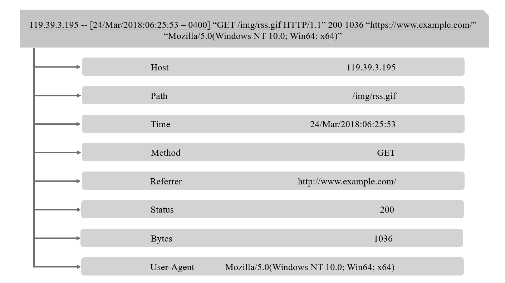
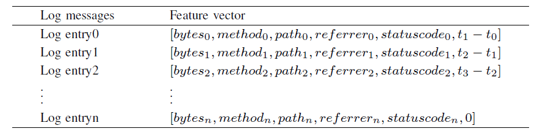
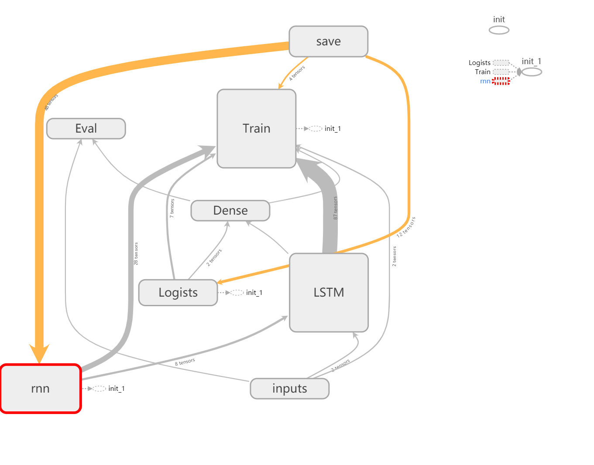
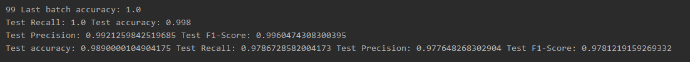
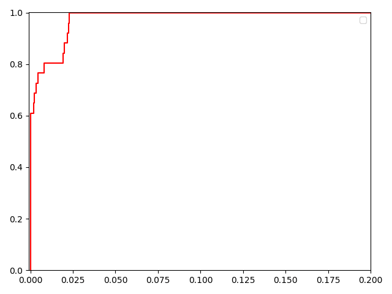

# 基于日志的Webshell检测方法

## 数据集

采用的数据为Nginx的日志文件，正负样本比例为1:6

## 特征提取

这个实验从网络的日志中提取了这特征，分别为访问路径的变化，访问时间的间距，状态码，响应长度，方法，和是否为跨站访问(Referer)，将这六个特征转换为数字之后形成一系列向量。

## 模型构建

本次试验采用了LSTM网络来构建模型,Tensorboard生成的模型结构体如下。

## 模型验证

经过检验，模型的准确率可以达到98.9%，召回率97.8%。

同时AUC也可以达到0.98以上

