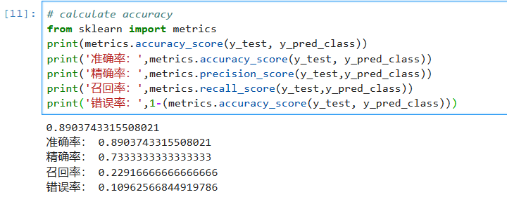
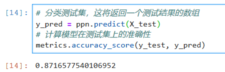

# WebShell detection

### 数据集
eduhtml和damahtml两个文件夹中分别存放常规和恶意样本

### 数据预处理
在PreProcess.py中将数据按照文件大小、标签个数、行数、标签类型转换成csv类型
```
dealdata.write(str(fsize)+'\t'+str(ftagnum)+'\t'+str(flinecount)+'\t'+str(ftagtype)+'\t'+str(fflag)+'\n')
```

### 模型训练
DataPlotAndPredict.ipynb

使用train_test_split随机划分训练子集和测试子集
，以及先验为高斯分布的朴素贝叶斯算法类GaussianNB
```
for randomNum in range(0,10):
    X_train, X_test, y_train, y_test = train_test_split(totalX, totaly, test_size=0.33, random_state=randomNum)
    clf = GaussianNB()
```

### 模型评估
使用sklearn.metrics中的评估方法




