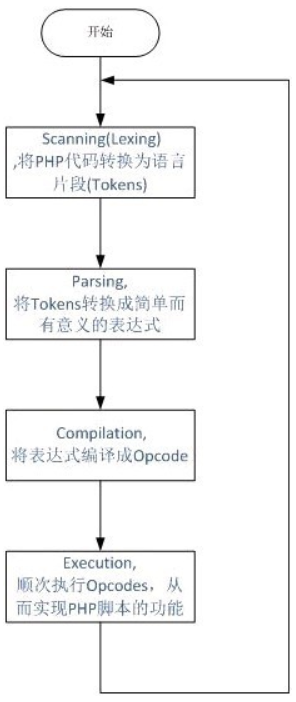

# webshell检测

## webshell是什么

webshell就是以asp、php、jsp或者cgi等网页文件形式存在的一种命令执行环境，也可以将其称做为一种网页后门。黑客在入侵了一个网站后，通常会将asp或php后门文件与网站服务器WEB目录下正常的网页文件混在一起，然后就可以使用浏览器来访问asp或者php后门，得到一个命令执行环境，以达到控制网站服务器的目的。

顾名思义，“web”的含义是显然需要服务器开放web服务，“shell”的含义是取得对服务器某种程度上操作权限。webshell常常被称为入侵者通过网站端口对网站服务器的某种程度上操作的权限。由于webshell其大多是以动态脚本的形式出现，也有人称之为网站的后门工具。

## 数据集选择

本次实验，我们采用了在网上收集的各种php文件（其中，正常文件1977个，webshell1637个，共3614个）作为数据集，值得注意的是，由于大多数的杀毒软件都会将webshell视为危险文件，甚至在取得用户同意之前就自作主张地将其删除，所以在获取该项目数据集之前应该设置好杀毒软件的选项，防止数据集的缺失。由于该项目的数据集单个样本占用内存较大且整体数目较少，故数据集缺少会对实验结果有较大影响。

##  OpCode 

OpCode就是Operation Code，顾名思义即操作码的意思。Opcode是php语言里供zend引擎执行的一种中间代码，类似java中的字节码、或者python中的字节码对象pycodeobject。 zend引擎必须从文件系统读取文件、扫描其词典和表达式、解析文件、创建要执行的计算机操作代码（Opcode），最后执行Opcode。每一次请求PHP脚本都会执行一遍以上步骤，如果PHP源代码没有变化，那么Opcode也不会变化 。下面这张图很清晰地告诉了我们Opcode在php运行过程中所发挥的作用。

【pic1】这里有一张图哟 ↓

## 数据处理

1. 将php_webshell文件目录下的所有php webshell标记为1

2. 找出white文件目录下的所有php文件标记为0，即不是webshell

3. 使用cmd = "php -dvld.active=1 -dvld.execute=0 命令运行php环境，运行命令获取操作码以及操作码数目

   

## word2vec

### 什么是word2vec

如果用一句比较简单的话来总结，word2vec是用一个一层的神经网络(即CBOW)把one-hot形式的稀疏词向量映射称为一个n维(n一般为几百)的稠密向量的过程。为了加快模型训练速度，其中的tricks包括Hierarchical softmax，negative sampling, Huffman Tree等。

在NLP中，最细粒度的对象是词语。如果我们要进行词性标注，用一般的思路，我们可以有一系列的样本数据(x,y)。其中x表示词语，y表示词性。而我们要做的，就是找到一个x -> y的映射关系，传统的方法包括Bayes,SVM等算法。但是我们的数学模型，一般都是数值型的输入。但是NLP中的词语，是人类的抽象总结，是符号形式的（比如中文、英文、拉丁文等等），所以需要把他们转换成数值形式，或者说——嵌入到一个数学空间里，这种嵌入方式，就叫词嵌入（word embedding)，而 Word2vec，就是词嵌入（word embedding) 的一种。

在 NLP 中，把 x 看做一个句子里的一个词语，y 是这个词语的上下文词语，那么这里的 f，便是 NLP 中经常出现的『语言模型』（language model），这个模型的目的，就是判断 (x,y) 这个样本，是否符合自然语言的法则，更通俗点说就是：词语x和词语y放在一起，是不是人话。

Word2vec 正是来源于这个思想，但它的最终目的，不是要把 f 训练得多么完美，而是只关心模型训练完后的副产物——模型参数（这里特指神经网络的权重），并将这些参数，作为输入 x 的某种向量化的表示，这个向量便叫做——词向量。

## 训练模型：LSTM

### LSTM介绍

长短期记忆网络（LSTM，Long Short-Term Memory）是一种时间循环神经网络，是为了解决一般的RNN（循环神经网络）存在的长期依赖问题而专门设计出来的，所有的RNN都具有一种重复神经网络模块的链式形式。在标准RNN中，这个重复的结构模块只有一个非常简单的结构，例如一个tanh层。

LSTM是一种含有LSTM区块（blocks）或其他的一种类神经网络，文献或其他资料中LSTM区块可能被描述成智能网络单元，因为它可以记忆不定时间长度的数值，区块中有一个gate能够决定input是否重要到能被记住及能不能被输出output，这样就很大程度上弥补了普通RNN的不足。 

### 参数设置

1. 优化器选择：adam

   *优点：

   \1. 实现简单，计算高效，对内存需求少

   \2. 参数的更新不受梯度的伸缩变换影响

   \3. 超参数具有很好的解释性，且通常无需调整或仅需很少的微调

   \4. 更新的步长能够被限制在大致的范围内（初始学习率）

   \5. 能自然地实现步长退火过程（自动调整学习率）

   \6. 很适合应用于大规模的数据及参数的场景

   \7. 适用于不稳定目标函数

   \8. 适用于梯度稀疏或梯度存在很大噪声的问题

2. 激活函数选择：sigmoid

   sigmoid函数也叫Logistic函数，用于隐层神经元输出，取值范围为(0,1)，它可以将一个实数映射到(0,1)的区间，可以用来做二分类。在特征相差比较复杂或是相差不是特别大时效果比较好。
   
   *优点：
   
   平滑、易于求导。
   
   *缺点：
   
   激活函数计算量大，反向传播求误差梯度时，求导涉及除法；反向传播时，很容易就会出现梯度消失的情况，从而无法完成深层网络的训练。
   
   

### 训练结果

| 轮数 | loss   | acc    | val_loss | val_acc |
| ---- | ------ | ------ | -------- | ------- |
| 1    | 0.2412 | 0.9284 | 0.1928   | 0.9497  |
| 2    | 0.2385 | 0.9288 | 0.3016   | 0.9064  |
| 3    | 0.2321 | 0.9323 | 0.2165   | 0.9441  |
| 4    | 0.2097 | 0.9410 | 0.1946   | 0.9525  |
| 5    | 0.2092 | 0.9385 | 0.3583   | 0.8156  |
| 6    | 0.2412 | 0.9225 | 0.2697   | 0.9567  |

