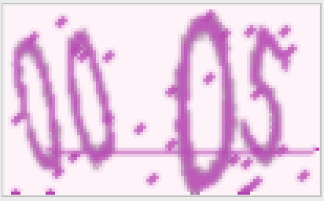
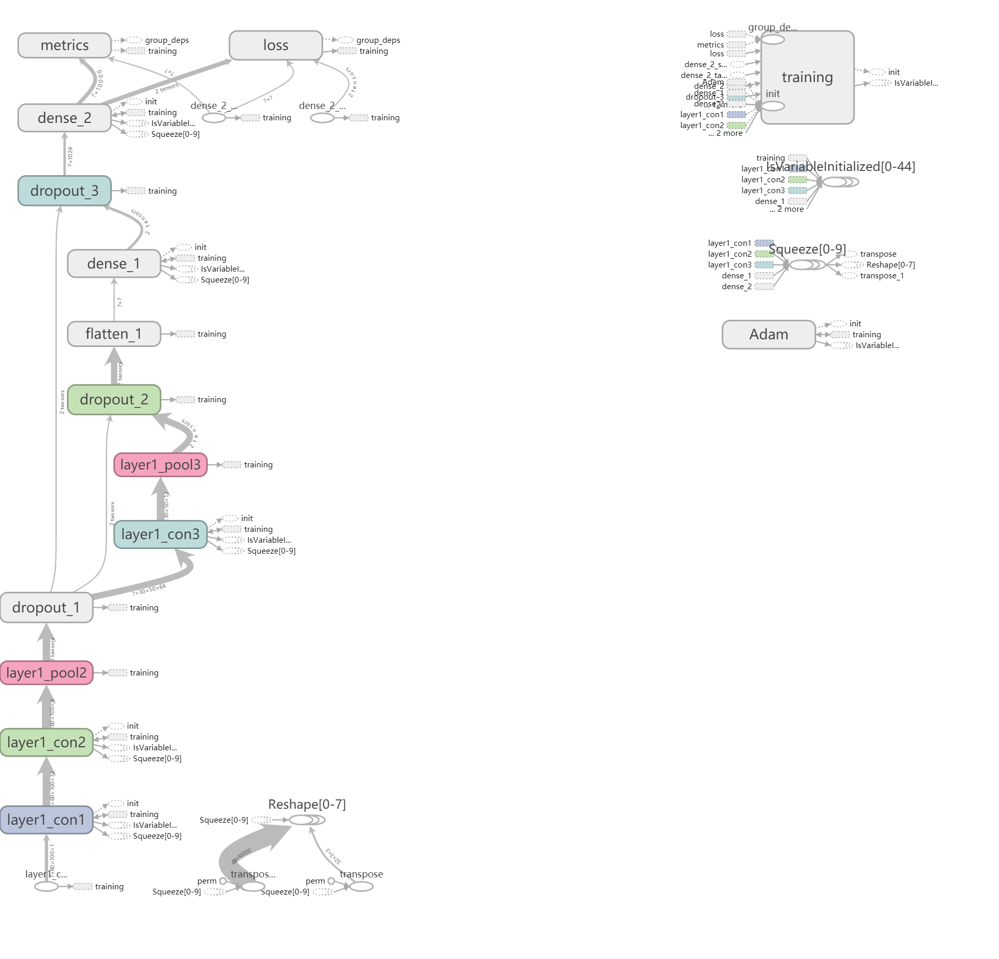

# 验证码识别

>   我们小组分别尝试了三个开源项目：
>
>   *   [cnn_captcha](https://github.com/nickliqian/cnn_captcha)
>
>   *   [captchatool](https://github.com/MMMzq/Captchatool)
>   *   [captcha](https://pypi.org/project/captcha/0.1.1/)

其中，我们利用cnn_captcha生成了字母+数字组合的验证码图片作为数据集：

并分别用这三个项目中带的验证码识别算法来识别他们，~~但是没有一个能打的~~最终我们向现实屈服，将验证码改成纯数字的，但是这些图片的切割仍然十分困难，有些数字甚至存在不完整的情况。

最后我们尝试修改了cnn_captcha中的识别算法并最终完成对验证码图像的识别：

*   使用了端到端的CNN卷积神经网络进行图像识别
*   准确率为 ，召回率为，

## 降噪

降噪的相关算法效果较为良好，但是有时候会把原始的数字内容降没（有时候颜色比较浅）

## 切割

切割我们尝试了很多方法，包括水滴算法，垂直投影，泛洪填充，但效果都不是很好，特别是对于往同一方向倾斜的，靠的比较近的两个字符，会完全没有效果。

## 网络结构

## 总结

1.  验证码识别是一个相对困难的问题，因为图片的特征是难以量化提取的、不足够线性的、难以描述的，使用一般的机器学习较为困难。
2.  如果是 数字 + 字母 的验证码，那么使用端到端的方式会非常困难，因为一共有36^4 超过1M的样本需要训练
3.  即使是纯数字的验证码，不做切割的情况下，训练的代价仍然较大，并且当形状、旋转、噪点、干扰线比较复杂的时候效果会更差一些

