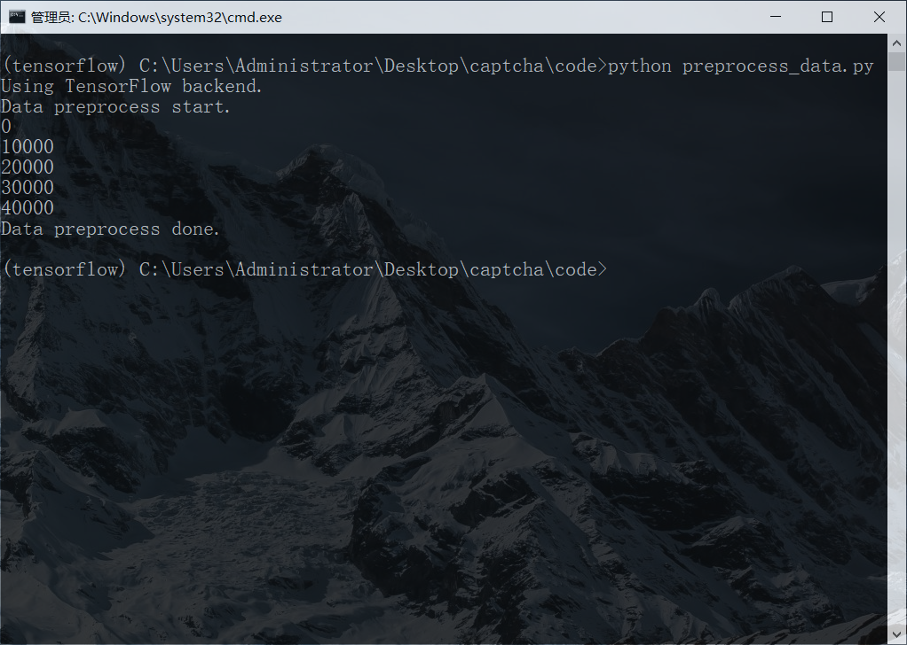
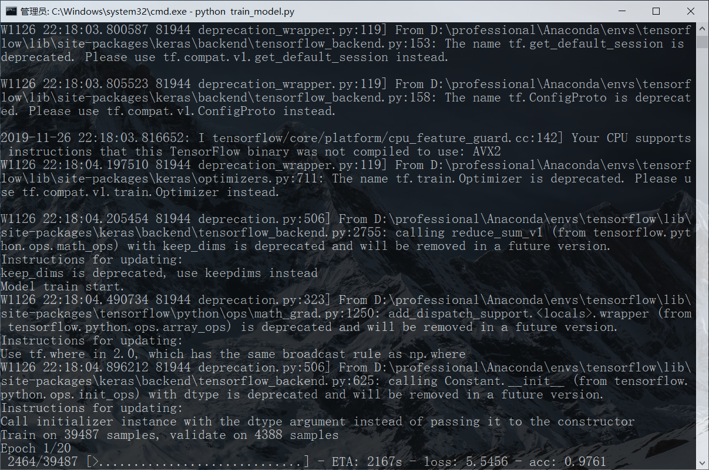
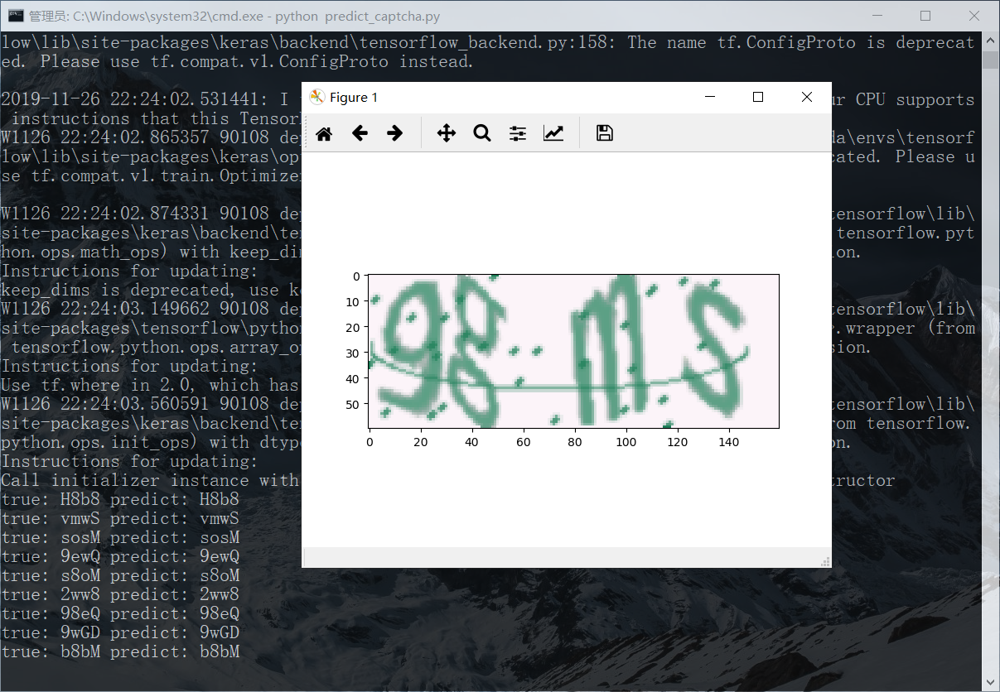

# Captcha Breaking Based on CNN

### 项目背景

**验证码**（CAPTCHA）是“Completely Automated Public Turing test to tell Computers and Humans Apart”（全自动区分计算机和人类的图灵测试）的缩写，是一种区分用户是计算机还是人的公共全自动程序。可以防止：恶意破解密码、刷票、论坛灌水，有效防止某个黑客对某一个特定注册用户用特定程序暴力破解方式进行不断的登陆尝试，实际上用验证码是现在很多网站通行的方式，我们利用比较简易的方式实现了这个功能。这个问题可以由计算机生成并评判，但是必须只有人类才能解答。由于计算机无法解答CAPTCHA的问题，所以回答出问题的用户就可以被认为是人类。</br>
本项目基于CNN神经网络实现了验证码的识别，经过测试，训练好的模型有较高的准确率和良好的泛化性能，能在一定程度上解决验证码识别的问题。

### 数据示例

本项目利用验证码生成算法共生成了**43875**张验证码图片作为训练样本，验证码图片都以png的形式进行保存。以下是验证码图片的示例：
</br>
<div align="center">

</div>
</br>
<div align="center">

</div>
</br>
<div align="center">

</div>
</br>

### 项目特点

- 本项目可应用于对**验证码的识别**，给出要识别检验码的文件夹后，可以得到识别的结果；
- 本项目采用验证码生成算法，构建了有**43875**条数据的数据集；
- 本项目基于深度学习的**CNN**模型来构建模型，并主要使用了深度学习库——**Keras**；
- 经过模型训练和测试，构建的模型的**准确度**能达到 **97%** 以上；
---


下面以四个部分介绍本项目：

- [项目环境依赖](#env1)

- [项目结构与运行方法](#env2)

- [系统运行截图](#env3)

---

## <span id="env1">二、项目环境依赖</span>

### 1. Anaconda集成环境
- Anaconda 4.7.10
- Python 3.5.5
### 2. 第三方库
- numpy 1.17.2
- keras 2.3.1
- matplotlib 3.1.0

## <span id="env2">三、项目结构与运行方法</span>

### 1. 项目结构

      ├── README.md                         
      ├── code                             // 存放程序代码文件
      │   ├── preprocess_data.py             
      │   ├── train_model.py                
      │   └── predict_captcha.py                
      ├── train                            // 存放用于训练的验证码图片
      ├── test                             // 存放进行识别测试的验证码图片    
      ├── dataset                          // 存放生成的训练集
      ├── output                           // 存放训练过程中模型的权重
      ├── model                            // 存放训练好的模型
      └── screen                           // 存放程序的运行截图
          ├── preprocess.png                 
          ├── train.png                         
          └── precict.png    

### 2. 运行方法

#### (1) 激活Anaconda环境
进入项目文件夹，并激活Anaconda环境。
```
activate tensorflow
```
#### (2) 数据预处理
将train文件夹中的验证码图片进行预处理，并保存生成的训练样本集。
```
python preprocess_data.py
```
#### (3) 模型训练
利用构建好的训练数据集训练CNN模型，并将训练好的模型保存。
```
python train_model.py
```
#### (4) 数据预测
用户输入要进行识别二维码的文件夹路径，程序能返回识别的结果。
```
python predict_captcha.py
```

## <span id="env3">四、系统运行截图</span>

### 1. 数据预处理截图
</br>
<div align="center">

</div>
</br>

### 2. 模型训练截图
</br>
<div align="center">

</div>
</br>

### 3. 数据预测截图
</br>
<div align="center">

</div>
</br>

------
