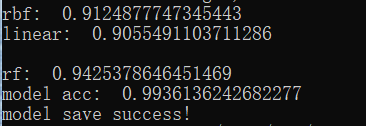
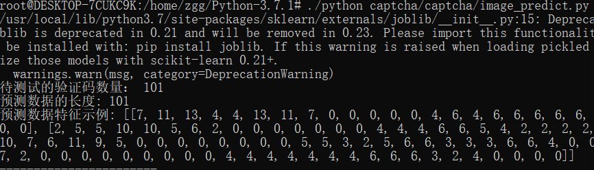
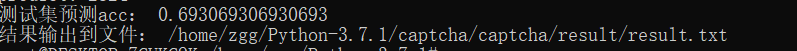

# 验证码检测
## 项目介绍
本项目是利用SVM对验证码进行分割识别
## 实验环境

-Ubuntu 18.04
-Python 3.7
-pillow/sklearn/numpy

## 文件结构
  ```
  |--code
    |-- image_feature.py
    |-- image_model.py
    |-- image_predict.py
    |--image_process.py
    |--image_training.py
  |-- Screen
  |-- README.md
  ```

## 实验过程

### 数据集
10000张验证码

### 验证码清理并生成训练集样本
 - 读取图片
 - 改变维度
 - 灰度化
 - 细粒度的清理方法
 - 单字符图像切割
 - 保存训练集
 - 提取特征
 - 训练识别模型
 - 模型测试
 - 预测

### 实验结果







