# 面向微博平台的情感分析与主题挖掘系统

## 项目简介

&emsp;&emsp;随着社交网络的高速发展，社交平台已成为舆情事件发生、发展与演化的重要阵地。因此，面向社交平台分析网络舆情发展趋势，挖掘舆情背后的深层规律，一方面能帮助管理者分析用户偏好、掌握用户需求，提高服务的个性化程度与用户体验；另一方面，能够客观反映社会舆论导向，系统全面的体现网民的社会价值观,帮助决策者提升应对突发事件的处置能力。针对现有网络舆情分析系统存在的舆情数据采集困难及分析方法单一等问题。本项目设计了一种高效的数据爬虫，并结合情感分析及观点挖掘的方法，研发了一套面向微博平台的网络舆情分析系统。通过构建该系统能够实现微博平台舆情动态快速的呈现，能够有效提高检测和掌控目标舆情发展趋势的时效性和便捷性。 

## 系统架构

&emsp;&emsp;本系统的总体架构分为四层，分别是数据层、技术层、分析层和应用层（即可视化层），系统架构如下图所示。下面对系统的整体架构进行说明。

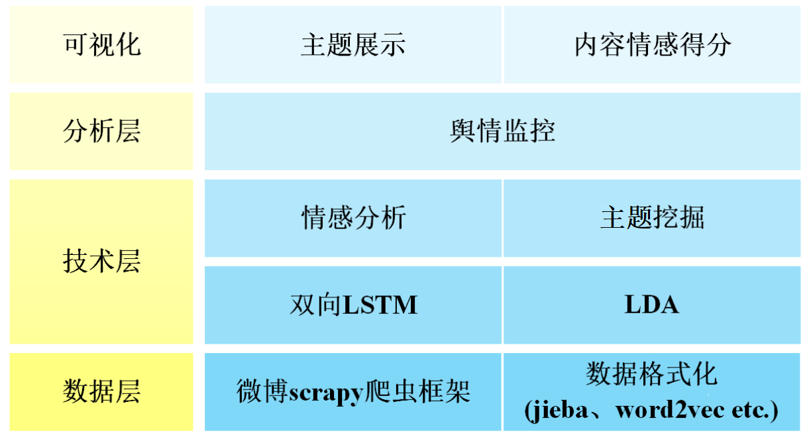

	1. 数据层

	系统的数据层主要完成的是数据的采集以及数据清洗和预处理工作。在这一部分，我们利用scrapy框架编写了微博爬虫程序对微博的数据进行爬取，初期总共爬取了五万多条用户的文本数据。之后需要对原始数据进行数据的清理，将原始数据中的标签等无意义符号去掉。将清洗过数据利用jieba进行分词，并将结果转化为词向量。

	2. 技术层

	系统的技术层可以被认为是系统的核心部分，这部分主要实现的是系统的核心功能。一是进行文本的情感分析，二是进行文本的观点挖掘。对于这两个核心功能，选择不同的模型进行训练，并得到最后的分析器。在情感分析部分，使用的模式是双向LSTM模型，其对于处理文本数据有显著的优势。在观点挖掘部分，使用的是非监督模型LDA，其主要是用来识别大规模文档集或语料库中潜在的主题信息。

	3. 分析层

	在实现了系统的核心功能之后，就可以通过对文本的综合分析，来达到舆情监控的目的。可以通过判断文本的情感倾向以及主要观点，从而分析出文本是否有引导舆论的倾向、是否是不良言论等，以协助进行舆情的监控和分析。

	4. 可视化

	系统可视化是人机友好的体现，可以提高系统的易用性。系统采用B/S架构，通过对系统的功能进行封装，将系统的核心功能的实现作为后端，同时制作简洁、清晰的前端来对结果进行显示。同时定义一系列的用户操作行为，来提高用户交互的体验感，使得整个系统更加完整、成熟。

## 数据采集——基于Scrapy的微博爬虫

&emsp;&emsp;现阶段，对于微博平台数据的挖掘方式主要是依托爬虫技术，利用爬虫可以更好、更快、更多的获取微博平台上的数据。因此本项目采用Scrapy框架构建微博爬虫，爬取微博博文，构建样本数据集。Scrapy框架示意图如下所示。

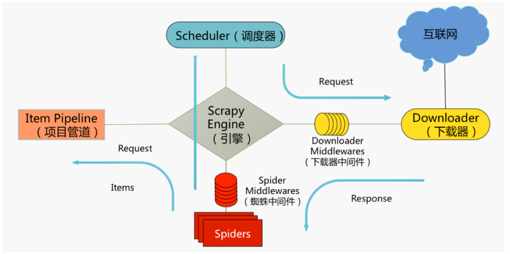

## 数据预处理

&emsp;&emsp;对数据的预处理包含以下四个步骤：

	1. 数据清洗
	2. 数据标记
	3. 文本分词
	4. 词向量化

&emsp;&emsp;数据预处理完成后的数据如下图所示。

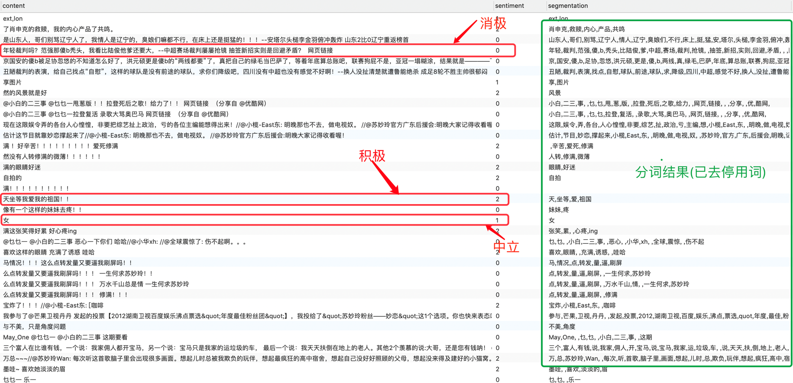

## 基于双向LSTM的微博情感分析

&emsp;&emsp;在进行微博情感分析时，我们使用了维基百科的中文的词向量。并建立了双向LSTM模型进行数据的训练。情感分析详细过程如下图所示。

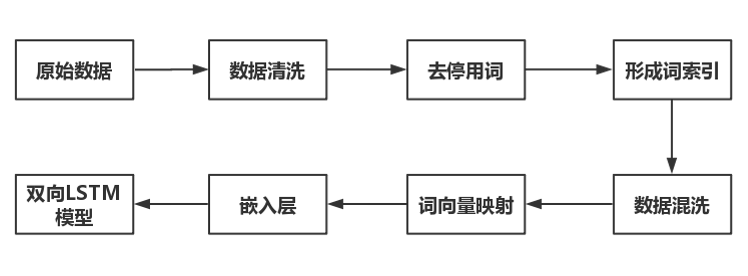

## 基于LDA的主题提取

&emsp;&emsp;在主题提取部分，我们使用了LDA模型进行主题与文章分类提取并使用困惑度进行评估。

&emsp;&emsp;主要步骤如下所示：

	1. 使用结巴分词对每一条微博文本进行分词处理，然后再进行词频统计，将其转化为以词频表示的向量作为LDA的输入；
	2. 设置参数stop_words停用词；
	3. 从文档中推断出自定义个数的不同的主题；
	4. scikit-learn的LDA实现采用期望最大化(EM)算法来迭代更新参数估计，我们设置为5次迭代。
	5. 为了分析，我们列出主题中每个主题的15个最重要的单词。

&emsp;&emsp;主题提取的结果如下图所示。

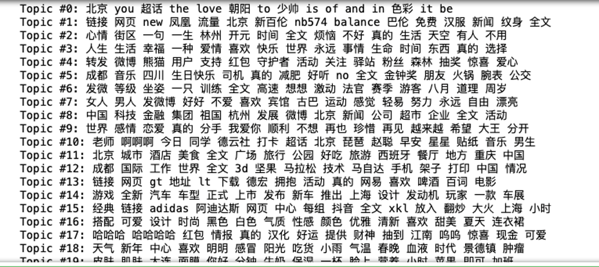

## 系统可视化

&emsp;&emsp;可视化部分基于flask框架进行了开发，文本、图表相结合，清晰明了，如下图所示。

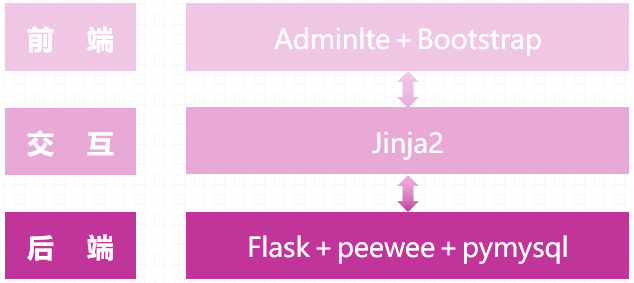

&emsp;&emsp;前端页面展示如下图所示。

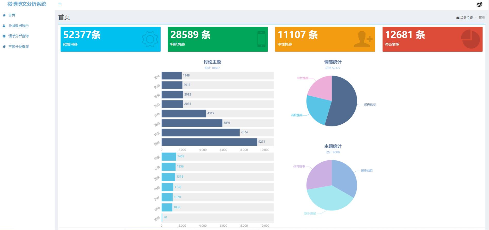

 

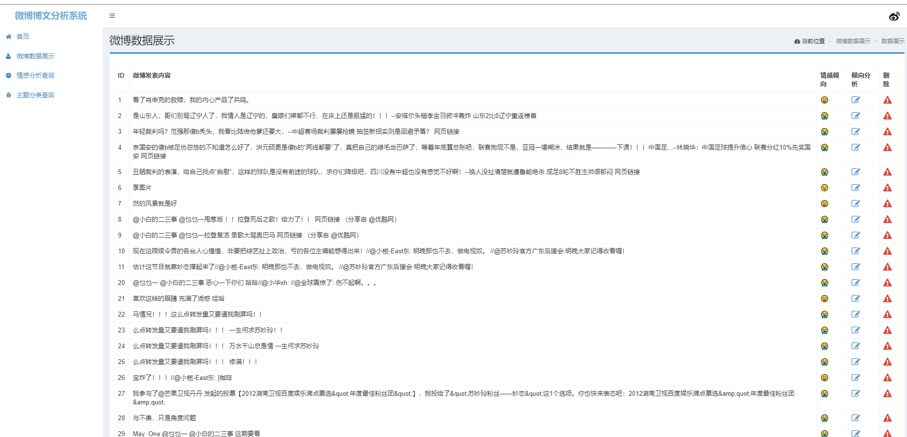

 

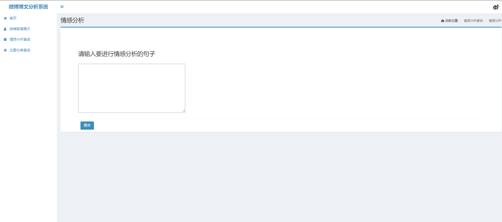

 

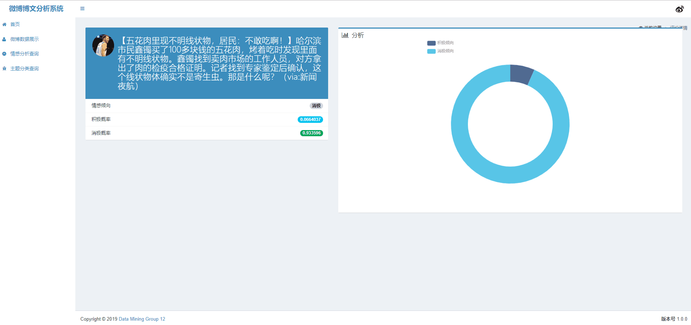

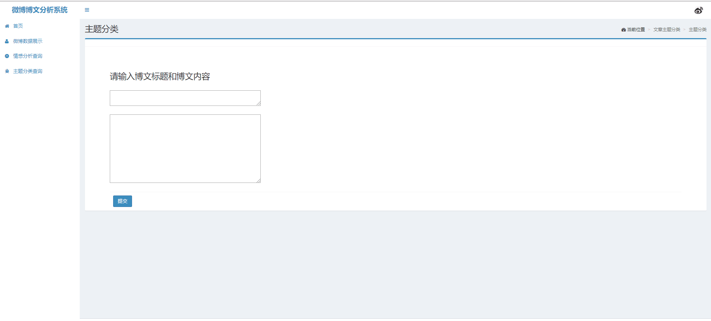

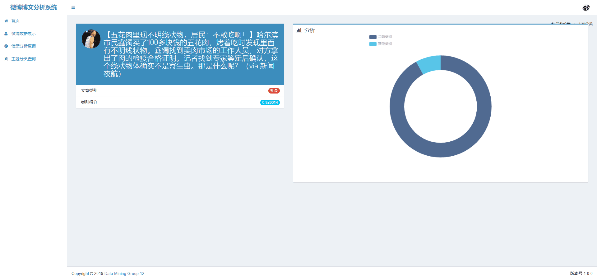

## 总结

&emsp;&emsp;随着社交平台的不断推广，人们更愿意在这些平台发表一些内容来表达或者宣泄自己的情绪。而微博作为我国一个重要的平台，每天都会有很多的微博内容发布，热点事件的讨论。一方面，人们的情绪反应着自己的生活状态，另一方面，如果可以对这些内容进行一个有效的分析，就能更好地为舆情分析作贡献。

&emsp;&emsp;本项目实现了一个简单的微博舆情分析平台。我们使用scrapy框架爬取了微博数据，并以微博的短文本数据构建了项目的数据集。同时，我们对采集到的数据进行了提取、标记、分词、向量化等预处理工作。本项目使用了BiLSTM情感分析模型，将BiLSTM学习文本的语义信息使用在词向量上，实验表明，这个模型在情感分类上取得了良好的效果，表现出了优越的性能。同时，我们还使用LDA对主题进行了提取，并搭建了一个基于flask框架的可视化平台，对主题统计结果以及情感统计结果、情感分析结果进行了可视化展示。同时，我们也提供了一个情感分析查询功能，使得用户可以自行输入数据，并获得情感倾向分析结果及概率展示。

&emsp;&emsp;但是，本系统仍然存在着一定可改进的地方，我们对于情感的分类只分为了三类，但是如果将情感进行细粒度分类，就是情感分为更为具体的内容，就完成可以为各种社交平台提供舆情监控的任务，如有人情绪长期低落、抑郁等可以及时发现从而制止相关危险的事件发生。除此之外，对微博中一些特定用户进行分析，可以找出微博中的机器人，一些僵尸粉丝等，虽然目前微博可以分析关注的人在多长时间内没有微博动态的更新，但是这也不能说明其就是一个僵尸粉丝，而多加改进便于让用户清理粉丝或者关注人，同时也便于微博的监管。

---