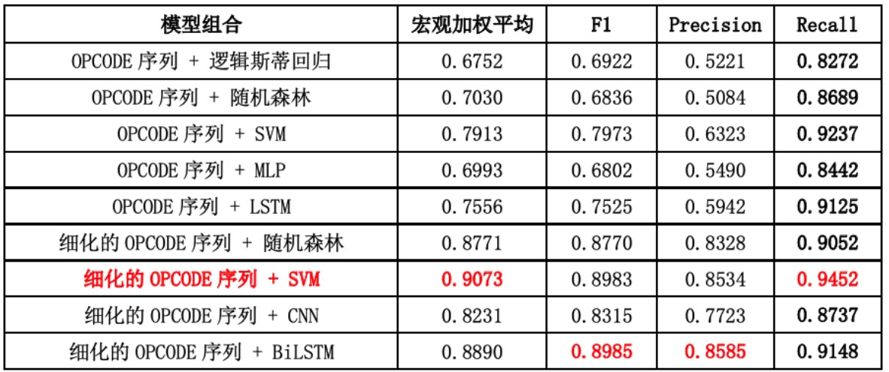
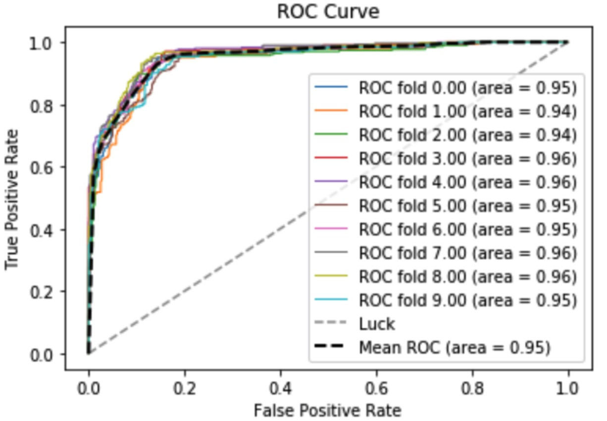

# 基于机器学习的PHP源码级XSS脆弱性审计

### 第2组 王一丁 李丞浩 缪昌伟

#### 呈现方式（在线系统/论文）：论文

0. 前言
   - 因个人原因论文内容暂时不做公开，望谅解；
   - Code/ 内的杂乱代码比较多，因为之前做了大量的实验，实验中性能以及指标最好的模型为细化的OPCODE+SVM，可由opcode+sink+svm.ipynb查看并执行；

1. 数据集：CWE-079公开数据集

   - 链接（百度云）：https://pan.baidu.com/s/1SfnmrmtfIbzV05a2xfHdLQ
   - 数据集CSV链接：https://pan.baidu.com/s/1qHi3Rs9NB0ePZ2Ys7sCjyg
   - 构成：5278条过滤安全的PHP代码块（白样本）、4352条存在XSS漏洞的PHP源码块（黑样本）；

2. 输入处理方式：

   - 使用PHP VLD提取OPCODE；

   - 聚类sink；

   - VLD提取filter及其他函数调用具体信息；

   - 将OPCODE再次细化；

     
     
     

3. 模型选择及评估：

   

   - 对于 MLP、CNN、LSTM 等神经网络实现的分类器，其训练过程往往比传统的机器学 习模型更复杂一些，然而在本实验中这三类模型并没有表现出更高的参数。

   - 另外，核化的 SVM 本身的时间复杂度 O(mn^2)是二次的复杂度，其中 n 是样本数，m 是特征数。当数据量较大的时候，还面临空间复杂度的问题，cache 的储存可能不够，因此 在数据量大特征多的情况下 SVM 的时间复杂度可能远超二次时间。但而对于源码审计这一 问题来说，输入向量和数据量的大小并不会很夸张。也就是说，在这种场景之下，SVM 在 拟合过程中所耗费的时间和空间资源是完全可以接受的。

   - 因此，我们可以综合对比上述实验结果，结合提升漏洞召回率这一研究目标，并且在考 量算法和模型的时间复杂度、空间复杂度基础之上得出结论:优化后的操作码序列与 SVM 的模型组合可以达到最高的指标，是最有效的方法。

4. 总结及未来工作

   - 本次课设基于操作码序列、自然语言处理相关算法以及机器学习模型，提出了一种 PHP 源码 XSS 脆弱性审计的新思路，这一思路可以辅助安全人员更有效地审计 Web 应用服务端的 源码中 XSS 漏洞情况，从而增强 Web 应用的鲁棒性。

   - 另外，实验表明我们的思路的确可以 显著地增加漏洞样本的召回率，从而最大程度减少漏报的可能性。未来的工作包括以下几点:一是利用 VLD 解析的详细信息对于输入 OPCODE 序列做 进一步的细化(以进一步提升精确率、召回率);二是在实际项目中找出相关的代码块，以 测试模型的泛用性;三是将该思路扩展到其它类型的 PHP 源码级脆弱性审计当中。